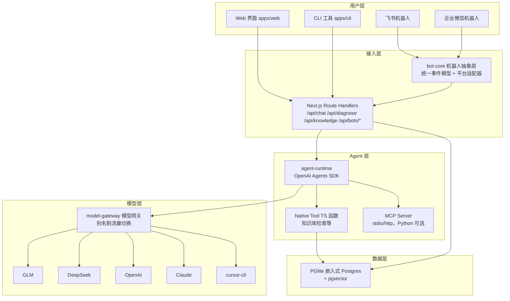
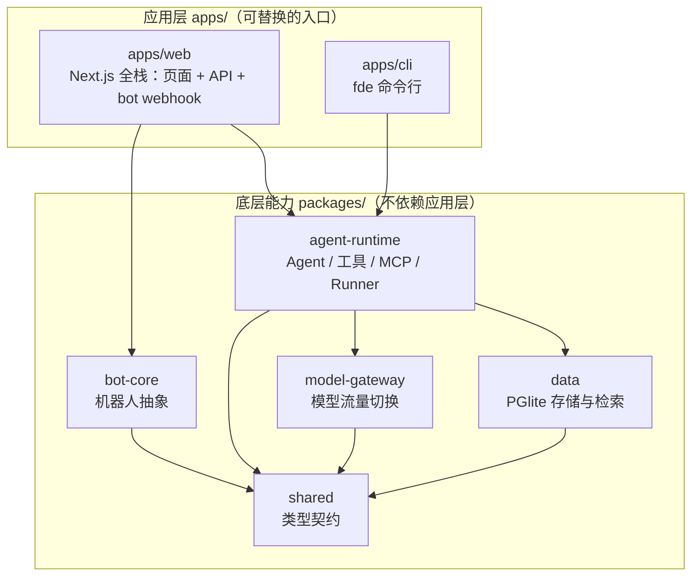
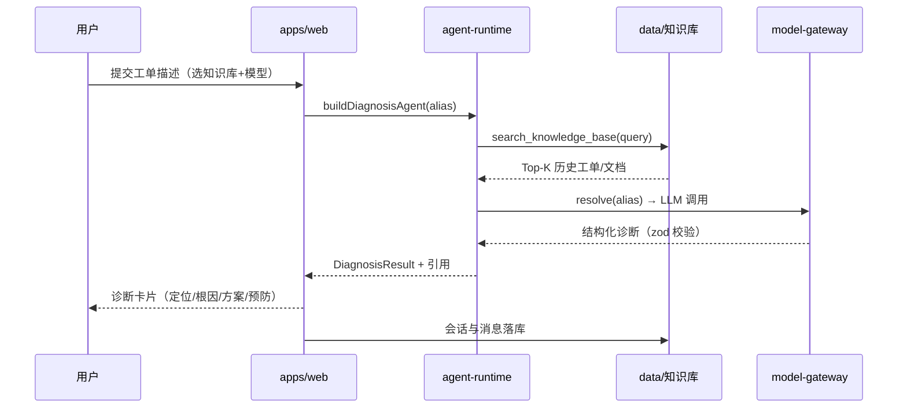
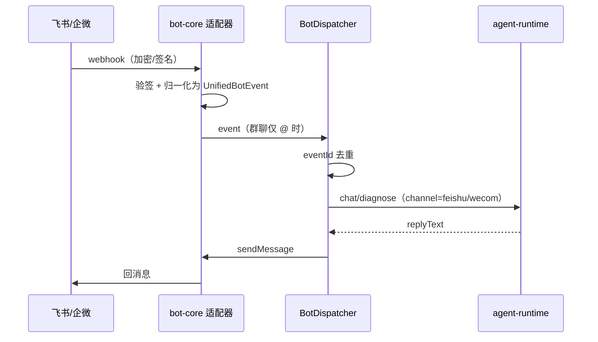

# fde-agent 地基设计文档

> 状态：已确认 | 日期：2026-09-19 | 作者：伊泽瑞尔 + AI (kimi-k3)
> 确认流程：本文档经伊泽瑞尔确认后才进入编码（ai-coding skill 核心流程）。

## 1. 背景与目标

fde-agent 是一个开源的**多场景智能体平台**：以知识库检索（RAG）+ 可插拔场景（scenario）为核心，提供 Web、CLI、IM 机器人三种接入方式，模型流量可在多家供应商间自由切换，本地优先、可私有化部署。

**首个场景是「工单诊断」**；平台会持续迭代新场景，路线图包括：简历修改、饮食规划、教育现实、劳动力经济、分析建模、电商报价、沙盘推演等。架构上场景以「Agent 定义（instructions + tools + 输出 schema + UI 入口）」注册接入，新增场景不动框架（见 5.3）。

- **fde-agent（web）**：类豆包聊天界面，当前核心场景是「基于知识库检索的工单诊断」，支持历史记录、知识库管理、模型切换；本地可跑，可部署到服务器/k8s。
- **fde-agent-cli**：命令行入口，抽象封装 claude / codex / cursor 等 coding CLI（订阅额度或 API Key 两种计费模式），可切换 GLM / DeepSeek / GPT / Claude / cursor 流量，对接 MCP。
- **机器人接入**：飞书、企业微信等 IM 机器人，机器人层做抽象。
- **AI coding 规范**：用仓库根 `AGENTS.md` 固化「设计先行 → 确认 → 编码 → 冒烟验证」流程；Cursor / Claude Code / Codex CLI 共用同一份（见 [ADR 0002](../adr/0002-tool-agnostic-agent-instructions.md)）。

非目标（本阶段不做）：多用户权限体系、计费、企业内部系统对接。

## 2. 总体架构

经典分层架构，单机场景做减法：网关不做限流熔断（单用户），但保留**流量切换**与**协议适配**。



## 3. 技术选型

| 决策点 | 选择 | 理由 |
|---|---|---|
| 语言 | 全 TypeScript | 前后端/CLI/机器人共享类型；开源 agent 项目主流（LobeChat、FastGPT、LibreChat 均为全 TS） |
| 全栈框架 | Next.js 15 (App Router) + React 19 | 页面与 Agent API 同仓同进程，单机部署最简单；Route Handlers 天然承载 webhook |
| Agent Runtime | `@openai/agents`（OpenAI Agents SDK JS 版） | 原生支持 MCP、流式、结构化输出、tool 审批；与「Native Tool + MCP」模型完全对齐 |
| 多模型接入 | Vercel AI SDK provider + `@openai/agents-extensions` 的 `aisdk()` 桥接 | GLM/DeepSeek 走 OpenAI 兼容端点，GPT/Claude 走官方 SDK，一处切换全部生效 |
| 数据库 | PGlite（WASM 嵌入式 Postgres）+ pgvector | 零外部服务、免 Docker；接口隔离，后续可换真 Postgres |
| Embedding | GLM `embedding-3`（OpenAI 兼容接口） | 国内直连、便宜；通过 env 可换 |
| CLI | Node + `commander`，子进程封装各家 CLI | 与主流 coding CLI 封装思路一致 |
| 机器人 | 自研薄适配层（无第三方 SDK 重依赖） | 飞书/企微协议都是 HTTP + 加解密，`node:crypto` 足够 |
| 包管理 | pnpm workspace | monorepo 标配 |
| 样式 | Tailwind CSS v4 + 手写轻量组件 | 豆包式 UI 不需要重组件库 |

## 4. Monorepo 结构

```
agent/
├── apps/
│   ├── web/                  # Next.js 全栈：页面 + /api/*
│   └── cli/                  # fde-agent-cli（bin: fde）
├── packages/
│   ├── shared/               # 领域类型（会话/消息/诊断/知识库/Provider/Bot）
│   ├── model-gateway/        # 模型别名注册表 + LanguageModel 解析
│   ├── agent-runtime/        # Agent 定义、Native Tools、MCP 管理、流式 Runner
│   ├── data/                 # PGlite：聊天历史 + 知识库 + 向量检索 + embedding
│   └── bot-core/             # 机器人抽象 + 飞书/企微适配器
├── .cursor/skills/ai-coding/ # AI 编码规范 skill（随仓库走）
├── docs/                     # 文档（分类与命名见 docs/README.md）
└── deploy/                   # docker-compose / k8s 清单
```

依赖方向：`apps/* → packages/*`，`shared` 不依赖任何内部包；`agent-runtime` 依赖 `model-gateway` 和 `data`；`bot-core` 只依赖 `shared`（不反向依赖 runtime，由 web 层接线）。

**应用层与底层能力严格分层**（应用层可任意替换/新增入口，底层不感知）：



## 5. 模块设计

### 5.1 packages/shared — 领域模型

纯类型包，五个域：`chat`（会话/消息/SSE 事件）、`diagnosis`（工单/诊断结果）、`knowledge`（知识库/文档/分块）、`provider`（模型描述/传输方式/CLI 认证模式）、`bot`（统一事件/出站消息）。

关键约定：
- 模型别名格式 `<provider>:<model>`，如 `glm:glm-4.6`，全系统流通只用别名。
- SSE 事件 `ChatStreamEvent`：`delta / tool_call / tool_result / diagnosis / usage / done / error`。

### 5.2 packages/model-gateway — 模型网关

- `registry.ts`：模型目录（静态 catalog）+ 凭据探测（env 有 key 才 enabled）+ 别名解析。
- `gateway.ts`：`ModelGateway.resolve(alias) → LanguageModel`（AI SDK v5）。
- 流量切换 = 换别名，零代码改动；新增模型 = catalog 加一行 + env 加 key。
- cursor 流量 `transport: "cli"`，走 cli 后端而非 HTTP 网关。

### 5.3 packages/agent-runtime — Agent 运行时

- `model.ts`：`aisdk()` 桥接，把 LanguageModel 喂给 OpenAI Agents SDK。
- `tools.ts`：Native Tool——`search_knowledge_base`（RAG 检索，zod 参数校验）。
- `mcp.ts`：`McpManager`，从 `FDE_MCP_SERVERS`（JSON）加载 stdio/http MCP server，Python 写的也行。
- `agents.ts`：两个 Agent——聊天 Agent（流式 Markdown）与诊断 Agent（`outputType` 结构化：问题定位/根因分析/解决方案/预防措施/置信度）。
- **场景可插拔（架构预留）**：每个场景 = 一份 Agent 定义（instructions + tools + 输出 schema + UI 入口）。当前场景硬编码在 `agents.ts`；当第二个场景（如简历修改）落地时，把 Agent 定义抽成 scenario 注册表（`packages/agent-runtime/scenarios/`），web/cli/bot 通过场景 id 选择，框架代码不变。
- `run.ts`：`streamChat()` 把 SDK 事件归一化成 `ChatStreamEvent`；`runDiagnosis()` 返回结构化结果 + 引用溯源。

### 5.4 packages/data — 数据层

- PGlite 单实例，一个数据目录装全部：会话、消息、知识库、文档、分块（`vector` 列）。
- `KnowledgeStore`：建库、文档入库（split → embed → 存 chunk）、余弦相似度检索。
- `ChatStore`：会话 CRUD、消息追加、首条消息自动起标题。
- 文本切分：段落优先递归切分（500 字 / 重叠 50），接口隔离可替换。

### 5.5 packages/bot-core — 机器人层

核心抽象（加平台 = 实现接口，上层不动）：

```ts
interface BotAdapter {
  readonly platform: BotPlatform;                    // "feishu" | "wecom"
  handleWebhook(req: BotWebhookRequest): Promise<BotWebhookResult>;  // 验签+归一化
  sendMessage(msg: UnifiedBotMessage): Promise<void>;
}
```

- 统一事件 `UnifiedBotEvent`：平台、事件 ID（去重）、群/私聊、是否 @我、纯文本、原始报文。
- 飞书适配器：url_verification 握手、`im.message.receive_v1` 解析、tenant_access_token 获取与缓存、回消息。
- 企微适配器（双模式）：① 应用消息回调（SHA1 + AES-256-CBC 验签解密，能收能发，做交互）；② 群机器人 webhook（只发不收，做诊断结果推送）。
- `BotDispatcher`：事件 → 交给 agent 处理器 → 回复；群聊只在被 @ 时触发；事件 ID 去重。
- 扩展性：未来接钉钉/Slack 等只需新增一个 `BotAdapter` 实现并注册到 dispatcher。

### 5.6 apps/web — Next.js 全栈

页面（豆包式布局）：
- 左侧栏：新建对话 / 历史对话列表 / 知识库入口 / 设置。
- 主区：消息流（Markdown 渲染、诊断卡片、工具调用折叠展示）、顶部知识库选择器 + 模型选择器、底部输入框（@ 提及、深度思考开关）。

API（Route Handlers）：
| 路由 | 说明 |
|---|---|
| `POST /api/chat` | SSE 流式聊天（可选知识库 → RAG） |
| `GET/POST /api/sessions`、`GET/DELETE /api/sessions/[id]` | 历史记录 |
| `GET/POST /api/knowledge`、`POST /api/knowledge/[id]/documents` | 知识库管理与文档入库 |
| `POST /api/diagnose` | 结构化工单诊断 |
| `GET /api/models` | 模型目录（含 enabled 状态，驱动选择器） |
| `POST /api/bots/feishu`、`GET/POST /api/bots/wecom` | 机器人 webhook |

#### 5.6.1 交互规格（主聊天页，对标豆包）

线框：

```
┌──────────────┬──────────────────────────────────────────────┐
│ fde-agent    │ 会话标题          [知识库: 支付域 ▾] [模型 ▾] │
│──────────────┼──────────────────────────────────────────────┤
│ + 新建对话   │  ┌ 用户消息（右对齐气泡）────────────────┐   │
│              │  └───────────────────────────────────────┘   │
│ 历史对话     │  ┌ AI 回答（Markdown 流式渲染）─────────┐   │
│ ├ 工单诊断.. │  │ ┌ 诊断卡片 ────────────────────────┐ │   │
│ ├ 支付超时.. │  │ │ 问题定位/根因分析/解决方案/预防措施 │ │   │
│ └ ...        │  │ │ 置信度 ●●●○○  引用: 3 条历史工单  │ │   │
│              │  │ └────────────────────────────────────┘ │   │
│ 知识库       │  │ [▸ 调用工具: search_knowledge_base]     │   │
│ 设置         │  └───────────────────────────────────────┘   │
│──────────────┼──────────────────────────────────────────────┤
│              │ [@ 提及] [知识库 ▾] [深度思考 ○]             │
│              │ ┌──────────────────────────────┐ [发送 ↑]   │
│              │ │ 输入消息…                     │            │
│              │ └──────────────────────────────┘            │
└──────────────┴──────────────────────────────────────────────┘
```

状态清单：
- 空会话：欢迎语 + 快捷入口（「诊断一个工单」预填 prompt）。
- 历史为空：侧边栏显示占位文案。
- 流式中：打字光标 + 「停止」按钮替换发送按钮。
- 工具调用中：折叠条显示工具名，展开可见参数/结果。
- 错误：消息内联错误卡片 + 「重试」按钮（重发同一条）。
- 模型/知识库未配置：选择器置灰 + 引导去 `.env` 配置的提示。

交互矩阵（关键路径）：

| 动作 | 反馈 | 边界 |
|---|---|---|
| 发送消息 | 立即上屏（乐观更新）→ SSE 流式渲染 | 断网：错误卡片 + 重试 |
| 流式中点停止 | 中断 SSE，保留已生成内容 | 重复点击幂等 |
| 点击历史会话 | 加载消息列表并滚动到底 | 加载中骨架屏 |
| 删除会话 | 二次确认后删除 | 删除当前会话 → 回空会话态 |
| 切换模型/知识库 | 仅影响后续消息，不回溯 | 切换时正在流式 → 不打断 |
| 深度思考开关 | 下条消息展示推理过程 | 模型不支持 reasoning 时置灰 |

视觉细节（配色/圆角/间距）实现时先出 `docs/prototypes/chat.html` 原型确认，再落 React 组件。

### 5.7 apps/cli — fde-agent-cli

后端抽象（核心差异点）：

```ts
interface AgentBackend {
  readonly id: string;                      // "claude-cli" | "codex-cli" | "cursor-cli" | "api"
  readonly auth: "subscription" | "apikey"; // 订阅额度 or API Key
  chat(req: BackendChatRequest): AsyncIterable<string>;
}
```

- CLI 后端：spawn `claude` / `codex` / `cursor-agent` 子进程；`subscription` 模式复用 CLI 已登录订阅，`apikey` 模式向子进程注入对应 env key。
- `api` 后端：直连 model-gateway（GLM/DeepSeek/GPT/Claude API）。
- 命令：`fde chat`（交互式）、`fde diagnose <工单>`、`fde backend use <id>`（切后端）、`fde models`（列流量）、`fde config`。
- 配置文件 `~/.fde/config.json`；也可作为 MCP client 直连 MCP server 调试。

## 6. 数据模型（PGlite）

```sql
chat_sessions(id, title, channel, knowledge_base_id, model, created_at, updated_at)
chat_messages(id, session_id → cascade, role, content, model, knowledge_base_id, usage jsonb, created_at)
knowledge_bases(id, name unique, description, embedding_model, created_at, updated_at)
knowledge_documents(id, knowledge_base_id → cascade, title, source, mime_type, created_at)
knowledge_chunks(id, knowledge_base_id, document_id → cascade, content, ordinal, embedding vector)
```

一个知识库固定一种 embedding 模型（建库时记录，不混用）。

## 7. 核心流程

### 7.1 工单诊断（web）



### 7.2 机器人消息



## 8. ai-coding 工作流（本仓库的编码宪法）

1. **设计先行**：任何新模块/大改动，先写设计文档到 `docs/design/yyyy-mm-dd-<主题>.md`。
2. **确认再码**：设计文档经伊泽瑞尔确认后才写实现代码；小修小补（改 bug、文案、样式）可豁免。
3. **类型契约**：跨包数据结构一律先进 `packages/shared`，禁止各自定义重复类型。
4. **依赖方向**：只允许 `apps → packages`，包间依赖单向，禁止循环依赖。
5. **配置走 env**：密钥/端点只读 env，`.env.example` 同步更新，禁止硬编码。
6. **完成定义**：`pnpm typecheck` 与 `pnpm lint` 全绿；关键路径冒烟通过（服务端 curl 实测、CLI 实跑、UI 交互用 Playwright 实测）。
7. **提交规范**：Conventional Commits（`feat(cli): ...`）；里程碑提交同步更新 `VERSION` 文件。
8. **git 门禁**：`.githooks/pre-commit` 强制每次提交通过 VERSION 同步 + typecheck + lint；`pnpm install` 时自动挂载（`prepare` 脚本）。

## 9. 环境与部署

- **本地开发**：Node 22（用户目录安装 `~/.local/node`）+ pnpm；`cp .env.example .env` 填 key；`pnpm dev:web`。
- **数据**：默认 `.data/pglite`（已 gitignore），无需任何外部服务。
- **docker-compose**（后续）：web 单容器即可；可选换真 Postgres。
- **k8s**（后续）：单 Deployment + Service + PVC（PGlite 数据目录），manifest 放 `deploy/k8s/`。

## 10. 里程碑

| 里程碑 | 内容 | 验收 |
|---|---|---|
| M0 地基冒烟 | monorepo + shared/gateway/data/runtime + web 聊天跑通 | 选一个模型能流式对话 |
| M1 诊断闭环 | 知识库管理 + RAG + 结构化诊断卡片 | 录入文档后诊断有引用 |
| M2 CLI | 后端抽象 + chat/diagnose 命令 | `fde chat` 切换后端可用 |
| M3 机器人 | 飞书 + 企微适配器接入 | 群里 @ 机器人能诊断 |
| M4 部署 | docker-compose + k8s manifest | 一键部署到自有服务器 |
| M5 场景化 | scenario 注册表 + 第二个场景落地（候选：简历修改/饮食规划/分析建模/沙盘推演） | 新场景只加 scenario 定义，不改框架 |

## 11. 开放问题

1. embedding 默认用 GLM `embedding-3`（2048 维），是否需要本地 embedding 兜底（离线场景）？
2. 诊断 Agent 是否需要「多轮澄清」能力（信息不足时反问），还是首版一次性出报告？
3. 企微机器人用「应用消息回调」还是「群机器人 webhook」（前者功能全、后者零开发只能发不能收）？默认按前者设计。
