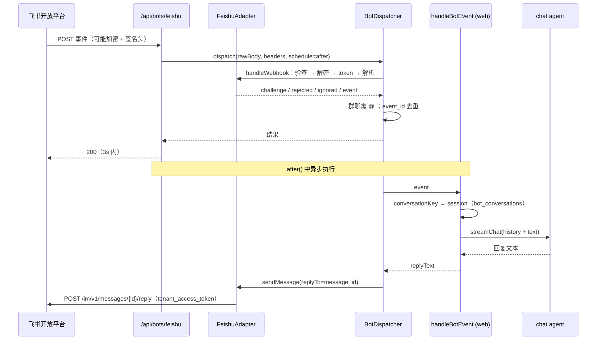

# 飞书机器人接入（M3 · 飞书）

> 状态：已实现（待 PR review 确认） | 日期：2026-09-29 | 作者：奥恩 + AI (grok)
> 范围：`packages/bot-core` 飞书适配器补全、`packages/data` 会话绑定、`apps/web` `/api/bots/feishu` 路由
> 说明：需求方明确授权「设计决策由 AI 自主决定」，Step 2 的确认以 PR review 代替；review 意见回填本文。

## 目标与非目标

**目标**

- 飞书用户私聊机器人、或在群里 @机器人，消息进入现有 chat agent 流程（知识库 RAG + MCP），回复回到飞书（群里以「回复该消息」形式出现）。
- 回调安全：Verification Token 校验；配置 Encrypt Key 时 AES-256-CBC 解密 + `X-Lark-Signature` 验签。
- 回调 3 秒内 ack，agent 运行与回复异步完成；飞书重试的事件按 `event_id` 去重。
- 飞书会话与 agent 会话持久绑定，追问可带上下文；`/new` 开新会话。
- 配置只来自 env；缺配置时路由返回 503 + 明确缺失项，其它功能不受影响。

**非目标**

- 富文本（post）、图片、文件、卡片消息的解析与发送（只处理 `text`，回复用 `text`）。
- 流式（卡片逐步更新）回复、结构化诊断卡片（后续可用消息卡片 `interactive` 实现）。
- 多副本部署下的分布式去重 / 会话锁（当前进程内实现，见「影响面与限制」）。
- 长连接（WebSocket）事件模式；本次只做 HTTP 回调模式。

## 方案对比与选型

| 维度 | 方案 A：官方 `@larksuiteoapi/node-sdk` | 方案 B（选定）：在现有 `bot-core` 薄适配层上补全 |
|---|---|---|
| 依赖 | 新增重依赖（axios 等） | 零新增运行时依赖，`node:crypto` + `fetch` |
| 与现有抽象 | 需要包一层适配 `BotAdapter` | 直接扩展已有 `FeishuAdapter` / `BotDispatcher` |
| 可测试性 | 需 mock SDK 内部 | 注入 `fetch`，单测直接断言 HTTP 调用 |
| 一致性 | 与企微适配器风格不一致 | 与 `WeComAppAdapter` 同构 |

地基设计（2026-09-19-foundation §3）已定「自研薄适配层，无第三方 SDK 重依赖」，本次延续。

- **异步处理**：路由把「跑 agent + 回消息」交给 Next.js `after()`，响应先返回；`BotDispatcher` 接受可注入的 `BotTaskScheduler`（默认 fire-and-forget），单测用收集器等待任务。
- **去重**：`EventDeduper`，TTL 12h（飞书重试窗口覆盖 15s/5min/1h/6h），上限 1 万条，按插入顺序淘汰。
- **会话映射**：私聊按 `chat_id` 一个会话；群聊按 `chat_id + 发送者 open_id` 一个会话（同群不同人上下文不串）。映射落库 `bot_conversations` 表，同一会话的消息串行处理（进程内 promise 链），保证历史顺序。
- **@ 判定**：群消息里的 mention 与机器人 open_id 比对（`/open-apis/bot/v3/info` 懒加载并缓存；失败时退化为「有任意 @ 即视为 @机器人」）。机器人自己的 `@_user_N` 占位符删除，其他人的替换为 `@姓名`。
- **token**：`tenant_access_token` 缓存至过期前 5 分钟；并发请求共享同一次获取；接口返回 token 失效码（99991661/99991663/99991664/99991668）时清缓存重试一次。
- **最小安全基线**：`FEISHU_VERIFICATION_TOKEN` 与 `FEISHU_ENCRYPT_KEY` 至少配一个，否则视为未配置（防止任何人伪造事件消耗模型额度）。

## 模块职责与接口

```ts
// packages/shared/src/bot.ts
interface UnifiedBotEvent { /* ... */ messageId?: string } // 新增：用于在线程内回复

// packages/bot-core
class FeishuCrypto {
  constructor(encryptKey: string);
  decrypt(encrypted: string): string;         // AES-256-CBC, key=sha256(encryptKey), IV=前16字节
  encrypt(plain: string): string;             // 测试 / 本地 mock 用
  sign(timestamp: string, nonce: string, rawBody: string): string;   // sha256(ts+nonce+key+body)
  verifySignature(ts: string, nonce: string, rawBody: string, sig: string): boolean;
}
function feishuConfigFromEnv(env?): { ok: true; options: FeishuAdapterOptions } | { ok: false; missing: string[] };
class FeishuAdapter implements BotAdapter { /* handleWebhook / sendMessage / tenantAccessToken */ }
class EventDeduper { firstSeen(key: string): boolean }
type BotTaskScheduler = (task: () => Promise<void>) => void;
type BotWebhookResult = ... | { kind: "rejected"; reason: string; status: number };  // 新增：验签失败 → 4xx
class BotDispatcher {
  constructor(opts?: { deduper?: EventDeduper; schedule?: BotTaskScheduler });
  has(platform): boolean;
  dispatch(platform, req, opts?: { schedule?: BotTaskScheduler }): Promise<BotWebhookResult>;
}
function botConversationKey(event: UnifiedBotEvent): string;

// packages/data
class BotSessionStore {
  getSessionId(conversationKey: string): Promise<string | null>;
  bind(conversationKey: string, platform: BotPlatform, sessionId: string): Promise<void>;
}
```

`/api/bots/feishu`：

| 方法 | 行为 |
|---|---|
| `GET` | 配置状态探针：`{ platform, configured, missing, encrypted }`（不含任何密钥） |
| `POST` | 未配置 → `503 {error}`；非法 JSON → `400`；验签/解密/token 失败 → `400/401 {error}`；challenge → `{challenge}`；其余 → `200 {ok:true, kind}` |

## 数据模型变更

```sql
CREATE TABLE IF NOT EXISTS bot_conversations (
  conversation_key TEXT PRIMARY KEY,      -- feishu:p2p:<chat_id> | feishu:group:<chat_id>:<open_id>
  platform TEXT NOT NULL,
  session_id TEXT NOT NULL REFERENCES chat_sessions(id) ON DELETE CASCADE,
  created_at BIGINT NOT NULL,
  updated_at BIGINT NOT NULL
);
```

幂等 `CREATE TABLE IF NOT EXISTS`，随 `getDb()` 迁移自动创建；会话在 Web 端删除时映射级联删除，下条消息自动新建会话。

## 时序



## 配置（env）

| 变量 | 必填 | 说明 |
|---|---|---|
| `FEISHU_APP_ID` / `FEISHU_APP_SECRET` | 是 | 应用凭证 |
| `FEISHU_VERIFICATION_TOKEN` | 与下项至少一个 | 事件订阅 Verification Token |
| `FEISHU_ENCRYPT_KEY` | 与上项至少一个（推荐） | 事件订阅 Encrypt Key，开启加密 + 签名校验 |
| `FEISHU_BASE_URL` | 否 | 默认 `https://open.feishu.cn`；Lark 国际版 `https://open.larksuite.com` |
| `FDE_BOT_MODEL` / `FDE_BOT_KNOWLEDGE_BASE_ID` | 否 | 机器人会话使用的模型别名 / 知识库（所有机器人平台共用） |

## 影响面与限制

- `BotWebhookResult` 新增 `rejected`；企微路由对其按原逻辑回 `success`，行为不变。
- `BotDispatcher` 回复改为带 `replyTo`；企微适配器忽略该字段。handler 抛错时回复通用失败文案（不外泄错误细节）。
- 旧 bot handler「每条消息新建会话、无历史」改为按会话绑定 + 带历史。
- 去重与会话锁为进程内状态：单实例部署足够；多副本需换 Redis 等共享存储（接口已隔离在 `EventDeduper`）。
- 测试：`packages/bot-core` 引入 `node:test` + `tsx`（仅 devDependency），`pnpm test` 执行；CI 增加 Test 步骤。

## 验收标准

- `pnpm typecheck && pnpm lint && pnpm lint:deps && pnpm test` 全绿，`pnpm --filter @fde/web run build` 通过。
- 冒烟：本地 mock 飞书开放平台，`next start` + 伪造加密签名事件，验证 challenge、验签拒绝、去重、异步回复到 mock `/reply` 接口。
- 真实联调步骤见 `docs/runbook/feishu-bot-setup.md`。
